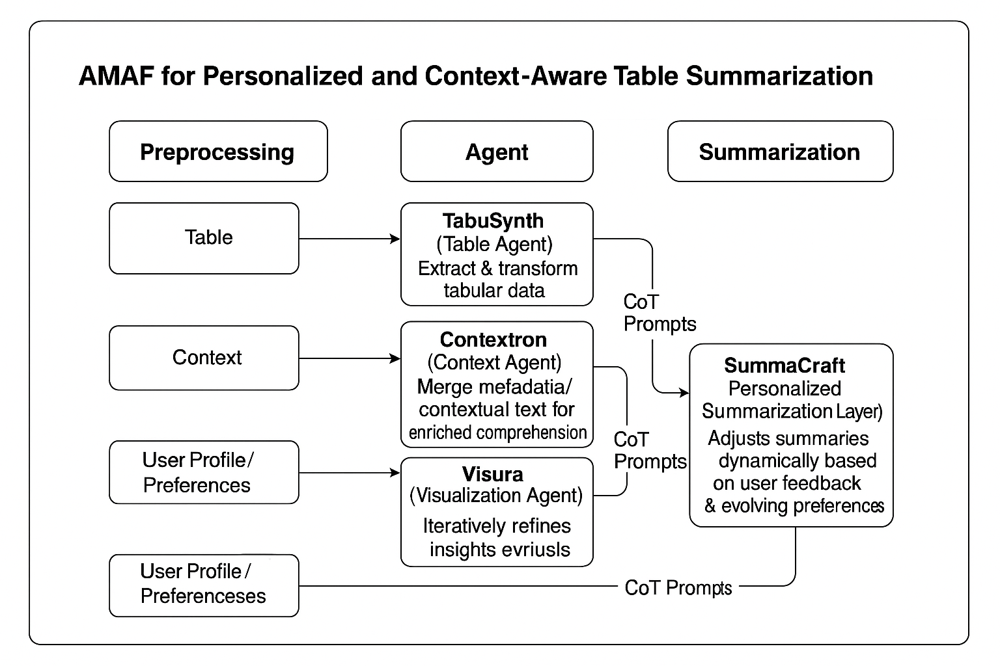
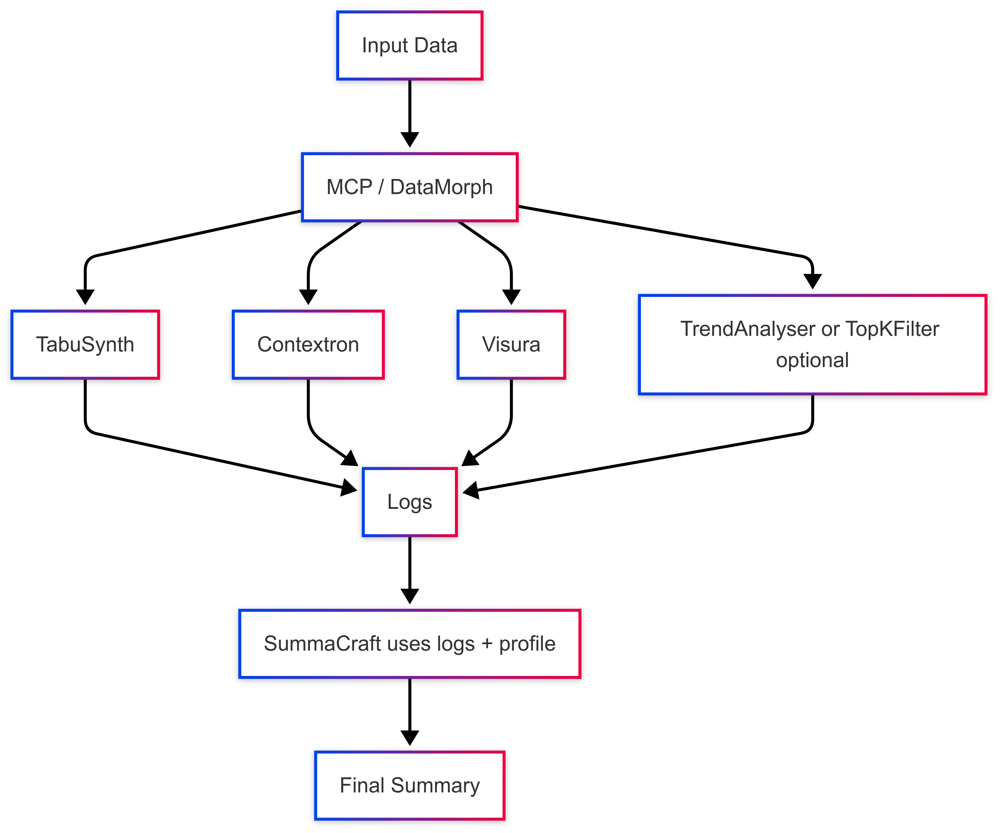

# AMAF: Adaptive Multi-Agent Framework for Table Summarization

AMAF (Adaptive Multi-Agent Framework) is a modular pipeline for personalized and context-aware table summarization using large language models.


## Pipeline Diagram



## 📁 Project Structure
```text
ADAF/
├── amaf/                 # Core agents + data classes
│   └── agents/           # Individual agent implementations
├── cli/                  # Command-line wrappers (evaluation etc.)
├── data/                 # Raw benchmark data dumps
├── diagrams/             # Architecture / flow charts
├── evaluation/           # Metric implementations + helpers
├── examples/             # Minimal JSON inputs for each dataset
├── scripts/              # Helper scripts (report builders, preprocessors)
├── run_amaf.py           # One-shot JSON execution
├── run_tatqa.sh          # Batch generation for TAT-QA
├── run_finqa.sh          # Batch generation for FinQA
├── run_mmqa.sh           # Batch generation for MMQA
└── requirements.txt
```
## 🔄 Pipeline Flow



## 🔧 Installation

```bash
python -m pip install -r requirements.txt

# ➊  Provide your OpenAI key (or place it in a .env file)
export OPENAI_API_KEY="sk-..."

# ➋  (Optional) override the default GPT-3.5-Turbo model
export AMAF_MODEL="gpt-4o-mini"

# ➌  Run the pipeline on a single example
python run_amaf.py examples/finqa/ZBH_2017_page_71.pdf-1.json
```
## 🧠 Agent Descriptions
- **TabuSynth**: Extracts structured facts from tabular data using TAPAS or T5. The
  prompt template resides in `amaf/prompts/tabu_synth.txt`.
- **Contextron**: Extracts contextual metadata (e.g., titles, notes, captions). The
  prompt template resides in `amaf/prompts/contextron.txt`.
- **Visura**: Converts visual cues to semantic tags.  It now also accepts an
  `image_path` and performs OCR before summarising the visual.
  The prompt template resides in `amaf/prompts/visura.txt`.
- **TrendAnalyser**: Spots the two most important numeric trends.
  The prompt template resides in `amaf/prompts/trend_analyser.txt`.
- **SummaCraft**: Performs personalized summarization using CoT prompting. The
  prompt template resides in `amaf/prompts/summa_craft.txt`.

## 📓 Usage
```bash
python amaf/agents/summa_craft.py --input data/sample_table.csv --profile "retail investor"
```

## 🧪 Fine-Tuning
Use `notebooks/5_Finetune_Summarizer_Finance.ipynb` to fine-tune a FLAN-T5 or Mistral model using LoRA on financial summarization data.

This repository contains a modular Python implementation of the AMAF pipeline
for personalized, context‑aware table summarization using OpenAI's chat models
(defaults to `gpt-3.5-turbo`; override with the `AMAF_MODEL` environment variable).


## 📊 Evaluation

⚠️  The legacy `utils/rouge_bleu_eval.py` script has been removed.  
Use the workflow below powered by `python -m cli.eval_dataset`.

## 📊 Evaluation Workflow (new)

1. **Generate model outputs**

   Each helper script spins up AMAF, captures the summary + logs and now also
   writes a spreadsheet / JSON snapshot right next to the raw logs.

   ```bash
   # uses timestamp as RUN_ID, logs to out/tatqa_logs/<RUN_ID>/
   bash run_tatqa.sh
   # inside that folder you will see:
   #   *_out.txt     raw summaries
   #   run.json      generation snapshot (no metrics)
   #   run.xlsx      same in Excel
   ```

2. **Evaluate**

   ```bash
   LOG_RUN_ID=<timestamp from previous step>

   python -m cli.eval_dataset \
          --dataset tatqa \
          --gold    data/TATQA/tatqa_dataset_dev.json \
          --pred    out/tatqa_logs/$LOG_RUN_ID \
          --run_id  $LOG_RUN_ID            # save under results/...
   ```

   Output structure:

   ```text
   results/
     tatqa/
       <LOG_RUN_ID>/
         <EVAL_ID>/
           report_<LOG_RUN_ID>_<EVAL_ID>.json   # aggregates + per-question rows
           detailed_<LOG_RUN_ID>_<EVAL_ID>.xlsx # same as spreadsheet
   ```

   *If you supply `--openai_key`, CAE will be graded by GPT-4o.*

3. **What's in the spreadsheets**

   Columns:  `qid`, `question`, `gold`, `summary`, `answer_echoes`, one column
   per agent (`agent_TabuSynth`, `agent_Contextron`, …) plus metric columns
   (`em`, `f1`, `rems`, `hcs`, `cae`) for evaluation runs.

---

See `evaluation/README.md` for API details if you want to call the evaluator
programmatically.


## 🚀 Quick start

```bash
# 1️⃣  Generate outputs

# TAT-QA
bash run_tatqa.sh          # logs → out/tatqa_logs/<RUN_ID>/

# FinQA
bash run_finqa.sh          # logs → out/finqa_logs/<RUN_ID>/

# MMQA (multimodal)
bash run_mmqa.sh           # logs → out/mmqa_logs/<RUN_ID>/

# After each script you will find inside that RUN_ID folder:
#   *_out.txt     – raw summary + agent scratch-logs
#   run.json      – per-question snapshot (no metrics)
#   run.xlsx      – same content in Excel for quick browsing
```

`RUN_ID` defaults to a timestamp, or set it manually:

```bash
export RUN_ID=my_llama2_trial
bash run_tatqa.sh
```

---

```bash
# 2️⃣  Evaluate any generated run

LOG_RUN_ID=20240703_101212   # or $RUN_ID you just produced

python -m cli.eval_dataset \
       --dataset tatqa \
       --gold    data/TATQA/tatqa_dataset_dev.json \
       --pred    out/tatqa_logs/$LOG_RUN_ID \
       --run_id  $LOG_RUN_ID            # required for results archiving
       # optional extras
       # --eval_id   my_metric_ablation
       # --openai_key $OPENAI_API_KEY
```

